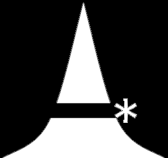

# `A*` pathfinding algorithm
A *graph-search* implementation of the algorithm.  

This implementation might traverse a node multiple times if its global score `G(N)` was changed (decreased) once the algorithm has detected a shorter path from a different parent node.  
This allows non-consistent heuristic functions to take another chance at influencing the final decision if the intermediate score was changed.

